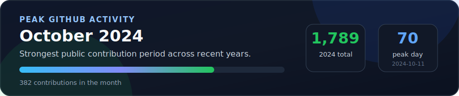

# Rohan Sharma

## About Me

I am a backend-focused Full Stack AI Engineer building production-grade AI systems, scalable voice AI agents, LLM applications, and high-performance backend services. My core interests are Go, system design, distributed systems, performance optimization, API design, RAG pipelines, AI agents, and practical LLM infrastructure.

- I design systems from HLD to LLD: service boundaries, data models, async flows, reliability, scaling, and trade-offs.
- I build AI products using LLMs, voice agents, RAG, tokenization, prompt/tool orchestration, and evaluation workflows.
- I write backend services in Go with focus on latency, cost, observability, maintainability, and clean architecture.
- I work across stacks when needed, but my strongest focus is backend architecture, AI infrastructure, and optimization.

## What I Build

- Backend platforms, APIs, microservices, queues, workers, and data-heavy systems.
- LLM-powered applications with RAG, agentic workflows, embeddings, retrieval, and model integrations.
- Developer tools and AI infrastructure that improve speed, cost, reliability, and engineering productivity.
- System design breakdowns that connect architecture decisions with real implementation details.

## Tech I Use

### Languages and Core Stack

### Backend, APIs and AI

### Data, DevOps and Tools

## Featured Work

| Project | Focus | Stack / Keywords | Stars | Forks |
| --- | --- | --- | --- | --- |
| [omnitoken](https://github.com/ron2111/omnitoken) | Pure-Go tokenizer and token counter for OpenAI BPE, WordPiece, SentencePiece, Gemini, Llama, Mistral, and Hugging Face adapters. | Go, LLM infrastructure, tokenization, performance |  |  |
| [AI Multi-Agent Calendar Scheduler](https://github.com/ron2111/multi-agent-ai-email-calender-scheduler) | Multi-agent scheduling system that parses email/API requests, coordinates Gmail and Google Calendar, resolves conflicts, and learns from feedback. | Python, FastAPI, Ray, GPT-4, Gmail API, Google Calendar API |  |  |
| [crawlPro](https://github.com/ron2111/crawlPro) | Async e-commerce product URL crawler with rate limiting, retries, domain-aware URL discovery, and scalable crawling architecture. | Python, aiohttp, async I/O, crawling, optimization |  |  |
| [Awesome Projects Collection](https://github.com/ron2111/Awesome-Projects-Collection) | Curated open-source project collection for learning, building, and contribution. | Open source, project ideas, community |  |  |

## GitHub Snapshot

---

Building useful AI systems, one well-designed backend service at a time.

